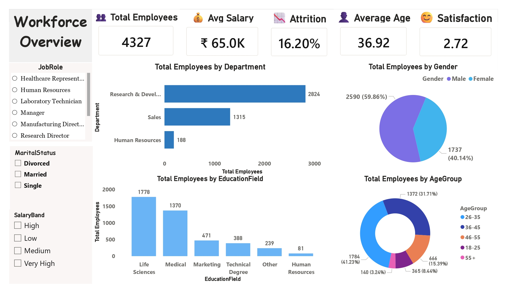
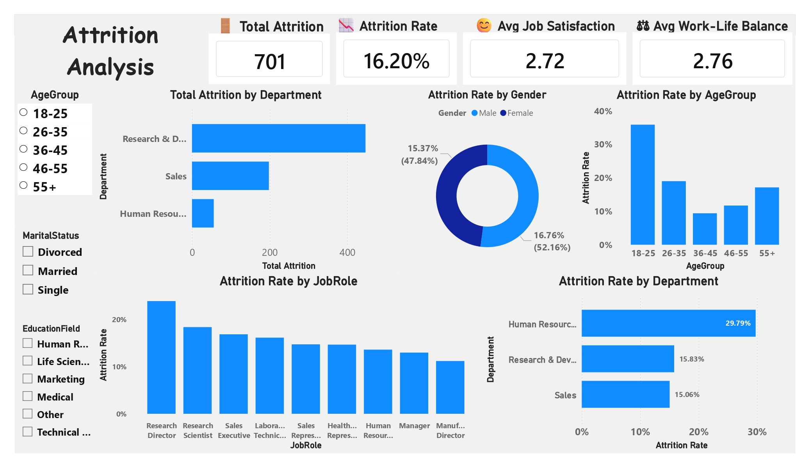
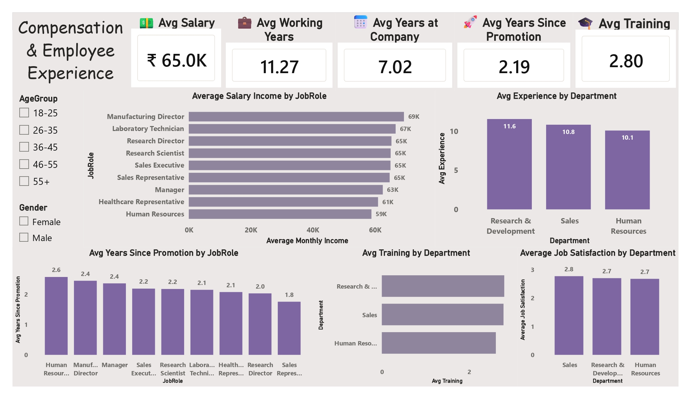
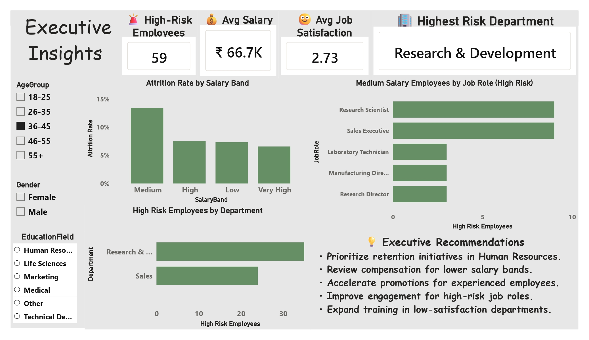

# HR Analytics Dashboard

## Overview

This project presents an end-to-end HR Analytics solution built using Python, MySQL, Power BI, and DAX. The objective is to analyze employee demographics, compensation, employee experience, and attrition patterns to generate actionable business insights for HR teams and executives.

---

## Project Objectives

- Analyze workforce demographics
- Understand employee attrition trends
- Evaluate compensation and employee experience
- Identify high-risk employee segments
- Generate executive-level insights for better decision-making

---

## Tech Stack

- Python (Pandas, NumPy)
- MySQL
- Power BI
- DAX
  
---

## Data Preparation (Python)

The HR dataset was cleaned and prepared using Python before analysis.

### Data Cleaning

- Removed duplicate records
- Handled missing values
- Standardized categorical values
- Verified data consistency

### Feature Engineering

Created several business-friendly columns including:

- Age Group
- Salary Band
- Job Satisfaction Label
- Work-Life Balance Label
- Performance Rating Label
- Tenure Group
- Income Per Job Level

The cleaned dataset was then imported into MySQL for business analysis and finally visualized in Power BI.

---

# Dashboard 1 — Workforce Overview

### Key KPIs

- Total Employees
- Average Monthly Income
- Attrition Rate
- Average Age
- Average Job Satisfaction
- Average Work-Life Balance

### Visuals

- Total Employees by Department
- Total Employees by Gender
- Total Employees by Education Field
- Total Employees by Age Group

---

# Dashboard 2 — Attrition Analysis

### Key KPIs

- Total Attrition
- Attrition Rate
- Average Job Satisfaction
- Average Work-Life Balance

### Visuals

- Total Attrition by Department
- Attrition Rate by Gender
- Attrition Rate by Age Group
- Attrition Rate by Job Role
- Attrition Rate by Department

---

# Dashboard 3 — Compensation & Employee Experience

### Key KPIs

- Average Salary
- Average Experience
- Average Years at Company
- Average Years Since Promotion
- Average Training

### Visuals

- Average Monthly Income by Job Role
- Average Experience by Department
- Average Years Since Promotion by Job Role
- Average Training by Department
- Average Job Satisfaction by Department

---

# Dashboard 4 — Executive Insights

### Key KPIs

- High-Risk Employees
- Average Salary
- Average Job Satisfaction
- Highest Risk Department

### Visuals

- Attrition Rate by Salary Band
- High-Risk Employees by Department
- Medium Salary Employees by Job Role
- Executive Recommendations

---

## Key Business Insights

- Human Resources has the highest attrition rate among all departments.
- Employees aged 18–25 experience the highest attrition.
- Lower and medium salary bands show relatively higher attrition rates.
- Research & Development contains the largest number of high-risk employees.
- Sales Executive and Research Scientist are among the most affected job roles.
- Lower job satisfaction and delayed promotions are associated with higher attrition.

---

## Skills Demonstrated

### Python

- Data Cleaning
- Feature Engineering
- Data Validation
- Pandas
- NumPy

### SQL

- CTEs
- Window Functions
- Ranking Functions
- Aggregate Functions
- CASE Statements
- Business Analysis

### Power BI

- DAX Measures
- Interactive Dashboards
- KPI Cards
- Drill-down Analysis
- Cross Filtering
- Data Storytelling

---

# Dashboard Screenshots

## Dashboard 1

---

## Dashboard 2

---

## Dashboard 3

---

## Dashboard 4

---

## Author

**Puneet Kaur**

B.Tech Production & Industrial Engineering

Aspiring Data Analyst | SQL | Python | Power BI | Excel
